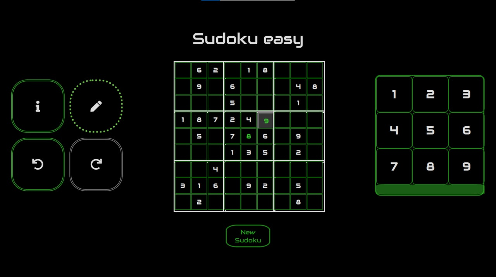

# Sudoku World

## Description
-

## Table of contents

1. [Introduction] (#introduction)
2. [Prerequisites] (#prerequisites)
3. [History & inspiration] (#history & inspiration)
4. [Walkthrough] (#walkthrough)
5. [Future improvements] (#future improvements)
6. [Conclusion] (#conclusion)
7. [License] (#license)

## Introduction

‘Sudoku World’ is an easy-to-use application for playing sudoku online.  It is a browser game that can be played across all devices – from small size smartphones to huge desktops. Created in terms of accessibility and scalabilty, it holds minimalistic, low detailed design in order to work perfectly with almost any type of screen. Offers a customizable options to fit individual user needs aswell as to make the overall gameplay more appealing. Consists of four difficulty levels that can be found, which complies different players’ skill degree. Hence ‘Sudoku World’ is an optimal choice for beginners, intermediate level players and for experts too. 

‘Sudoku World’ rules are fully based on original 3x3 Sudoku regulations. It works the same way as magazine („paper”) Sudoku puzzles do. Nothing fancy in here.

If You are not familiar with sudoku in general, or this is your first time encountering that kind of puzzle, please take a look at detailed Sudoku guide for an in-depth explanation of game rules, techniques and more.

## Prerequisites

There are couple of requirements that needs to be fulfilled to make sudoku solving experience the most enjoyable. 

1) Stable internet connection – since it is a browser application, it works the same way as usual websites. That means You will definitely need a constant Internet access. It not necessarily has to be very good connection (in fact, the app works fine even for weak ones), but the constancy is the key.

2) Avoid tablets – currently, it is not recommended to use the app for tablet-like devices (more specifically: machines that their screen height value is relatively close to its’ screen width value). The reason is the app on square-like screen would cover close to half of the whole available surface, making an unpleasant expereince. While it is not a strict requirement to avoid playing on tablets, I highly recommend using mobile devices or laptops / desktops instead.

Quick note: Above issue would be hopefully fixed soon.

3) Learn Sudoku fundamentals – as mentioned before, it is highly recommended to get a grasp of Sudoku rules and solving methods. Even if you feel like veteran-level Sudoku solver, I still encourage you to check  detailed Sudoku guide   (at least for it’s comprehensively explained ‘techniques’ section). All methods covered there are essential in order to solve all kind of Sudoku puzzles – from simplest up to the most complex ones.

## History & inspiration

Inspiration to create a sudoku application came spontanously. Personally, I used to solve a lot of paper-version sudoku puzzles back then, when had plenty of spare time. At the beginning of January 2022, I was having a conversation with my friends, and it turned out that many of them enjoy doing this activity too. Basically, it was a motivating factor to create a simple sudoku app that can be used by them. Despite the fact that the project was not scheduled by any means, a final action came real quick. 

Sudoku World project was initialized on January 23rd, 2022. The very first week was revolved around creating an initial landing page and sudoku board template. The Sudoku engine was slowly being formed, but unfortunately all the work had to be postponed (personal stuff).

March 12th was the comeback date. From on, the trickiest part began. Many aspects that seemed to be obvious and straightforward, in fact became absoloutely harsh to prepare correctly. The most significant improvements made, were to generate completely valid Sudoku grid and to create mechanism that checks if Sudoku has just one possible solution. March was also a month to debunk all naive approaches in regard of developing Sudoku game. In the long run it completely shift the direction of the application and moved it on the right track.

April and May were all about creating difficulty patterns. That was the most strenuous work to finish, simply because of implementing those methods into a game. Each technique involved developing a check algorithm (in most cases very complex) and also a lot of intense, case-specific testing, bug solving, etc. Ultimately, by the end of May, final sudoku rendering pattern was introduced, so that all major engine-based functionalities were completed.

The very last chapter of ‘Sudoku World’ development was adding some extra functionalities to the game and adjusting the application for various types of devices. Starting from half of the June, a pencilmark mode, history travel and info tab features got created, followed by a lot of visual improvements for each application aspect. A cherry on top was preparing an error page (hopefully you will not be forced to see it).

Finally, ‘Sudoku World’ got  deployed to production on July 27th, 2022. The live app version can be found there: https://sudokuworld.onrender.com/

## Walkthrough

This section is a guide through all functionalities ‘Sudoku World’ provides. You can follow along if necessary – here is the link: https://sudokuworld.onrender.com/

Note #1: This part represent the actual app state for version [1.1.0]. Any new feature added subsequently might not be covered there, so keep that in mind !

Note#2: Images used for this documentation represent the actual layout for laptops / computer screens. If you are using other device type, the layout may look a little bit different, but overall functionality remains the same. 

First off all - the landing page. If you follow above link, that screen should appear:

Landing page contains all the customization that you can adjust in preffered way. It is divided into three different categories:

1) Select theme – here you can choose the color scheme of application. It impacts only the visual aspects of the game. According to chosen theme, colors would be applied appropiately to all elements, with a slight exception of Reset view and Completion view. You can only choose one theme. Currently supported formats are light (sun icon) and dark (moon icon). The default value is dark.

2) Choose a difficulty – enables to choose a desired Sudoku level. Possibilities are as follows: easy, medium, hard, insane (also known as ‘master’). Only one difficulty level can be picked at once. Default value is set to none, which means that one has to specify the difficulty level before playing. When chosen, a „Play” button appears, which allows to begin the gameplay.

Very important note: In order to maintain reasonable Sudoku rendering time, choosing a difficulty is temporarily disabled. Even though picking specific difficulty box increases the chance to receive a corresponding puzzle, getting Sudoku with requested level is no longer guaranteed. To minify the issue, a reset button allows to quickly get another Sudoku puzzle. We are sorry for the inconvenience.

3) Options – allows to add some extra features to the game. They affect only the gameplay. You can include as many options as you want. By default, all options are disabled (set to false). The following are available:
	→ Add Timer: When enabled, counts up the time spent on solving Sudoku. Once 	 	 puzzle is completed, the total time is shown on Completion screen.

	→ Tile backlit: When enabled, it higlights all the Sudoku cells that share the same row,
	 column or 3x3 square, that currently focused cell belongs to.

Once you are done with customization part, it is the high time to play Sudoku. In order to do so, click „Play” button (should appear right below the customization section).

Afterwards, you can see the Gameplay page, which will look similiar to this:

It might look a bit confusing at first, but everything would be clear in a minute !

At the center of screen, there is a Sudoku board. That’s the puzzle ‘playground’, which represents current state of the game. To insert a number into a cell, you have to target it first. Simply click on the tile, and the cursor would appear right in this place:

Once the middle tile is targeted, it is possible to insert a digit there. As seen in above example, the only number that we can place (according to Sudoku rules) is 8. Using right-hand side  number box, let’s choose ‘8’ by just clicking on the appropiate tile:

Congratulations! That is how digit can be inserted into a cell. You can basically rinse and repeat this process until you solve the whole puzzle. 

However, mistakes could happen on the way. Whenever you find yourself in situation, where the wrong digit is accidentally put into a cell, there are two possible solutions:

The first one is to click on a „rubber”. That is the very last, rectangle-shape box at the bottom of number box. To make it easier to spot, it has been marked with a yellow color. Rubber allows to quickly remove any number from a cell.

Alternatively, if you look at above example – we want to remove this unnecessary ‘8’ from the top of middle 3x3 square. The cell is already targeted. Apart from using rubber, it is possible to pick ‘8’ from number box again. Instead of inserting ‘8’ anew, we will remove it from the cell. 

For this specific scenario, you can follow quicker approach. Since we are certain that the only correct number for top-right cell in middle 3x3 square would be 9, instead of removing 8, we can click on ‘9’ in number box to replace an existing digit with 9. That is way more effective !

From now on, you should be comfortable with basic functionalities of  ‘Sudoku World’. 

However we haven’t covered the left-hand side section yet. That is called toolbox, and contains several useful features (tools) that might be helpful in some specific cases. 

A honorable mention here is the „Pencilmark”. If you click on the pencil-icon box, you can notice some visual changes:

As shown in above image, the pencilmark’s icon borders has changed aswell as rubber box, which has its’ background color modified. That means the pencilmark mode is now set up. Let’s take a look at below image to see what pencilmark tool is capable of:

Basically, entering pencilmark mode allows to  make some notes of possible digits that can be inserted into a given cell. In this example, 3x3 square located in top row, middle column is fully marked using pencilmarks. 

This feature becomes handy especially when dealing with more challenging Sudokus, which require a lot of memoization or using some complex techniques. Also, if there is a cell which contains just two or three possible digits, there is nothing wrong with just adding them as pencilmarks. 

Applying a pencilmark is as simple as for a digit. For this purpose, a number box is also used to choose a pencilmark number. In fact, adding, replacing and removing pencilmarks works identical comparing to digits. 

However, there is one, slight difference. When entering pencilmark mode, there is no possibility to use rubber (note that the rubber box received a dimmed background color). In order to remove whole pencilmark group from a cell, the most effective way could be escaping pencilmark mode (just by clicking pencilmark box again) and then use rubber for targeted cell.

All pencilmarks are dynamic and adapts to your actions. That means, whenever a digit is inserted, each cell that shares the same row, column and 3x3 square would automatically remove these pencilmarks, which has the same number. To clarify, consider this quick case:

*Before adding a digit 1 to the targeted tile*

*After adding a digit 1 to the targeted tile (check top-middle and middle-right 3x3 squares) *

Toolbox also contains two fancy tools, that looks similiar to each other. They are part of time travel feature, Combined together, allows you to freely move around the past actions you have done. 

Time travel button that is closer to the left allows you to move backwards, while the one further from the left enables to move forwards.

Whenever you start new Sudoku game, as above image shows, time travel buttons have their borders gray colored. For each of these tools it means they are inactive. Since we haven’t done any action yet, there is no way to move forwards or backwards in time by any means.

Once we make our first action, „go-backwards” button will receive its’ border color:

That means there is a possibility to move backwards. In this case, by clicking „go-backwards” button, digit ‘2’ would be removed from the board and because from that point there is no other action we can move back for, the button would become inactive:

Surprisingly, „go-forward” button has become active now, which means when we click onto it, we will put digit ‘2’ back into its’ place. Because there is no other recent actions to move forward for, now „go-forward” button would become inactive (turning its’ border to color gray), while „go-backwards” button from now will be active (changing the border color to green back again):

Time travel might be helpful especially when, after some actions taken, you notice a mistake that had been made before, and it is too late just to use rubber to correct it:

Take a look at middle right 3x3 box for a moment. We want to insert a digit ‘2’ somewhere in here, but it seems like there is no possibilty for that. It is due to a miastake made in one of past actions. In middle Sudoku row there is digit ‘9’, applied twice. While it might look as an easy fix just to trade places between 2 and 9 (see middle 3x3 box), it will cause another issue with Sudoku’s sixth column, which would have digit ‘2’ inserted twice. At this point, any further action that you will take might make the situation even more complicated than that.

Erasing the whole Sudoku board is some sort of solution, although far from ideal. Basically it will force you to start everything from scratch – even the parts you had done correctly before making that mistake.

Instead, you can make a good use of time travel functionality:

By pressing very left time travel button, we were moving back in the game history. Finished clicking exactly when digit ‘9’ was accidentally inserted. Now we can safely trade places between digits ‘2’ and ‘9’ and continue from this point:

Notice that once we actually make a change in one of past actions, „go-forward” button became inactive. Here is also a very important part to remember:

Modifying one of actions done in the past, would override game history, hence it will no longer be possible to retrieve actions that was done after the changed  action.
To sum up: time travel buttons behaves the exact same way how CTRL + Z and CTRL + SHIFT + Z keyboard shortcuts do. 

Time travel feature might be useful if you would like to analyse your gameplay:

First off, make sure you are one action before completing Sudoku (don’t finish yet):

Then, by using „go-backwards” tool, move all the way back to the very beginning:

And finally – use time travel buttons to browse through the actions made. As long as you will not insert any number to one of past moves, you can freely come back to the very recent action and finish the puzzle.

Last Toolbox feature to describe is the Info Tab. That’s the button with ‘i’ icon. Once pressed, such screen should appear:

Here you can find some pieces of information regarding ‘Sudoku World’ application. This screen allows to track the recent app version and its’ realease date. There are also useful reference links – first one redirects to detailed Sudoku guide detailed Sudoku guide, the second one to  this documentation. 

As a side note, if you play Sudoku with a timer option included, this screen works as a pause button. It blocks timer from running until closing the tab.

By clicking „close” button at the bottom, you will return to a game with fullscreen mode enabled. If you wish to exit full screen mode, simply press „Esc” button on your keyboard. For mobile device users, you need to press a „<” button at the bottom-right of device screen.

At the beginning of this section, a reset button (‘New Sudoku’) was briefly mentioned. It minifies an issue regarding non-guaranteed Sudoku difficulty. It can be found right below Sudoku board.

The sole purpose of Sudoku reseting is to let you receive desireded difficulty puzzle as soon as possible. Once the button is pressed (and you haven’t taken any action yet), old Sudoku is being replaced with a new, random one almost instantly. It is just a quick rendering time and new Sudoku is showing up.

Using reset button still does not provide any warranty in terms of difficulty level.

I have done a quick research of how much time does it take to render 10 Sudokus with each difficulty. Below are the results (for each diffiulty there are three test cases):

10x Easy ~      00:34  ||  00:16  || 00:21 
10x Medium ~    03:51  ||  02:07  || 05:14
10x Hard ~      04:44  ||  04:12  || 04:11
10x Insane ~    01:11  ||  00:31  || 00:55

Reset button has in-built mechanism that prevents from accidental clicks. When at least one action is already made, clicking on the button will make a dialog box appear:

Clicking red „undo” icon on the left would exit this screen, keeping the same Sudoku with it’s current state. 

After pressing green „check” icon, new random Sudoku is being rendered. That is being said, all the progress made will be irrevocably lost, since this is one-way operation (it is not possible to retrieve that Sudoku back).

Each correctly solved Sudoku invokes a Completion screen to show up:

If you included timer as in-game option, Completion screen would look similiar to this one:

Clicking the ‘house’ icon on the left would redirect you to the landing (home) page, where you can change your customization and play next Sudoku with currently changed options, theme, etc.

By clicking ‘plus’ icon, a new Sudoku is rendered – with the same, previously adjusted customization. It works exactly as „reset button”, however without confirmation screen being shown.

## Future improvements

While ‘Sudoku World’ already received bunch of updates, it cannot be denied that there are parts that still needs some sort of improvements.

The major issue concerns non-guaranteed Sudoku difficulty. Picking a difficulty box from Landing page only increases the chance to obtain a respective puzzle. The goal here is to update the rendering part, so that player can get Sudoku with desired difficulty, and also it has to always happen in a very short, reasonable time. At very least, increasing the chance of obtaining medium and hard Sudokus could be a significant improvement, since those type of puzzles are beyond the rarest ones to receive at the moment.

Important change that needs to be delivered is preparing the good-looking layout for tablets. Those devices has the screen almost square-shaped, which stands as an exception to mobile devices, laptops and desktops, which screens are rectangle-shaped. On account of this difference, a new layout should be prepared across all Views in the application. That might mean creating a very individual approach, which could involve changing the position of elements, some sizing modifications and more.

Maximizing the grid size might make a huge difference for user experience. That is especially true for mobile device users. Portrait-oriented screens are quite okay in this matter (but still imperfect), however „landscape screens” has the Sudoku grid a bit too small. Restoring some space for Sudoku board would shrink adjacent – already spacious - sections (Toolbox and Number box) a little bit, so that playing Sudoku could be more enjoyable.

Last, but not least – options. Landing page still has just two options to customize, which does not seem like enough. There could be more of them, although it is a matter of brilliant ideas to implement a new customizable feature, which is an actual option - not something that every player has to click to make the gameplay enjoyable.

## Conclusion

Well – that’s it. By now we have learned all the basic and advanced features ‘Sudoku World’ has. 

Thanks for checking out the official ‘Sudoku World’ documentation ! If you would like to, you can also take a look at the changelog, which contains all recent updates for this application.

I would like to thank everyone who supported me during the development journey of ‘Sudoku World’. Also huge shout-out to Handmark (‘Sudoku of the day’) for their inspirational sudoku-revolved website, which shares a lot of useful tips that ‘Sudoku World’ is based around. 

Tools used:

 - React JS
 - Node JS (runtime)
 - Anime.js
 - Font Awesome
 - Render (hosting provider)

© Martimex 2022
